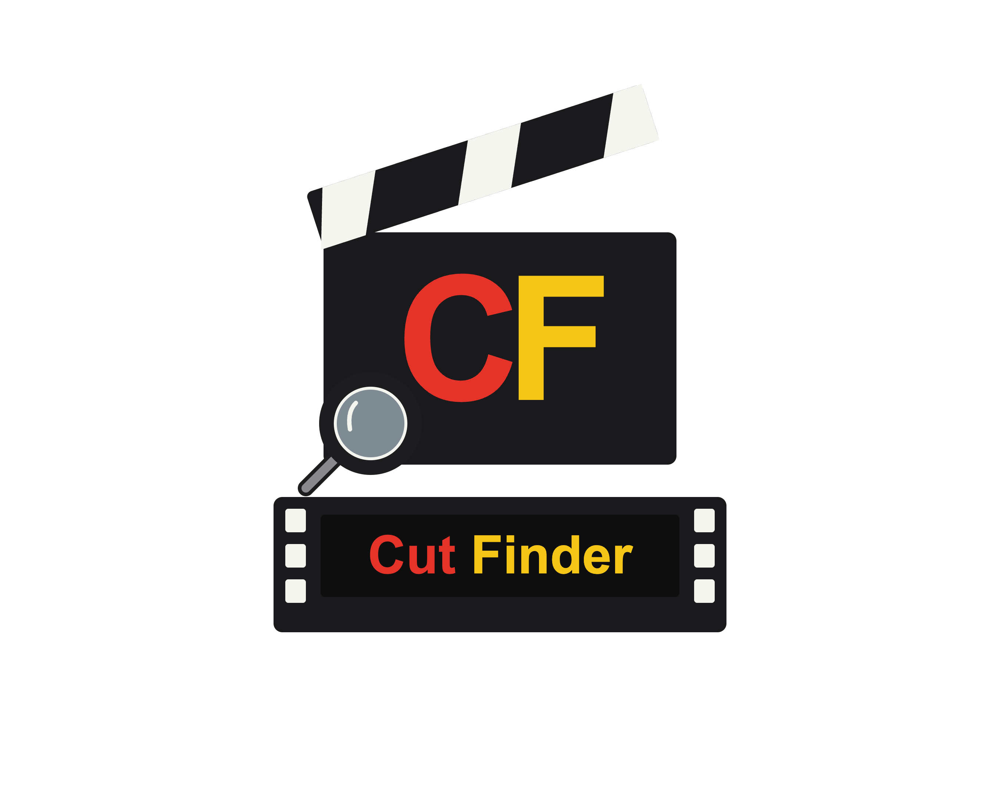
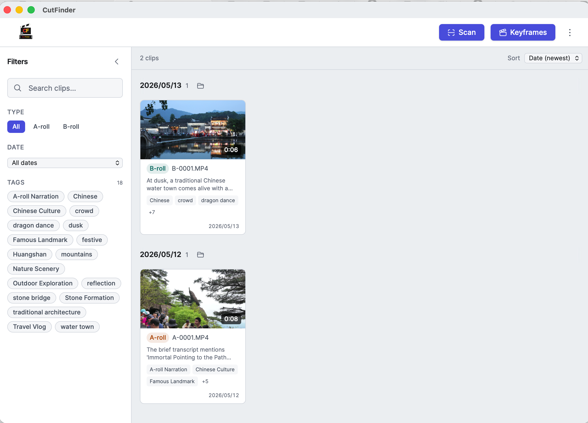
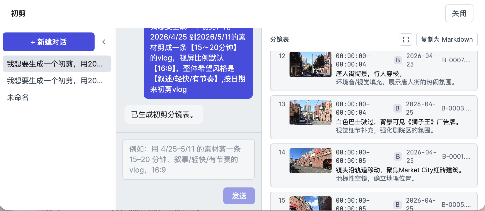

# CutFinder

<p align="center">
  
</p>

## Example

<p align="center">
  
</p>

<p align="center">
  
  <br/>
  <em>Rough-cut director (beta) — chat your requirements, get a date-chaptered shot list.</em>
</p>

> A local, offline tool that automatically classifies, tags, summarizes, and organizes your Vlog footage. Inspired by [Argus](https://github.com/discoposse/argus).

**中文文档 → [README-zh.md](./README-zh.md)**

CutFinder takes a pile of **A-roll** (clips with spoken narration — Chinese by default) and **B-roll** (pure visuals, no narration) and automatically **classifies, tags, summarizes, and thumbnails** every clip, so you can later find any shot by date, type, tag, or spoken line. Built for macOS (Apple Silicon) + Final Cut Pro workflows — **fully offline, all AI runs on your own machine.**

> ### ⚠️ Requires an Apple Silicon Mac (M1 or newer)
> CutFinder runs **only on M-series Macs**. Every model runs locally through Apple's MLX framework — OMLX (text/vision) and `mlx-whisper` / Qwen3-ASR + ForcedAligner (speech) are all **Apple-Silicon-only**. Intel Macs, Windows, and Linux are **not supported**.

---

## Get started — `make app`

The recommended way to run CutFinder is the native **`CutFinder.app`**: a small Swift/AppKit wrapper that hosts the UI in its own window (WKWebView, no browser tab), manages the local service, and **installs everything it needs on first launch**. One command builds it.

> **One prerequisite lives outside the app:** [OMLX](https://github.com/jundot/omlx), a local Apple-Silicon model server (menu-bar app). Install it and load `Qwen3.6-35B-A3B` (text) + `Qwen3-VL-8B` (vision). CutFinder detects it on first run and **guides you if it's missing** — scanning / transcription / thumbnails still work without it; only A-roll summaries and B-roll tags need it.

### 1. Build the app

```bash
git clone <repo> && cd CutFinder
make app          # → dist/CutFinder.app (and dist/CutFinder.dmg)
```

`make app` compiles the Swift wrapper with **SwiftPM** and bundles a prebuilt frontend, so the build host needs the **Xcode Command Line Tools** (`xcode-select --install`) plus Node. Anyone running a *prebuilt* `.app` needs neither — the `.app` carries the UI and backend source, and one service serves both (no Node at runtime).

### 2. Install & first launch

Drag `dist/CutFinder.app` to `/Applications` and double-click:

- **First launch self-installs everything.** A native setup screen shows progress while it syncs its runtime, installs `uv` and `ffmpeg` (auto `brew install` when Homebrew is present, otherwise it guides you), creates the Python environment (`uv sync`), and downloads the Whisper + Demucs models (~3 GB). Later launches start in a second.
- **The service starts automatically** and the UI loads in the app's own window. The **Service menu (服务)** can Start / Stop / Restart the backend, or "Open in browser" if you prefer a tab.
- **Standard Mac app behavior** — full application menu; closing the window keeps the service running; clicking the Dock icon reopens it; ⌘Q stops the service cleanly (no orphaned process).
- The runtime lives in `~/Library/Application Support/CutFinder/` (**outside the .app bundle**, for clean updates/signing); logs are at `launch.log` there.

> **Unsigned dev build?** When a Developer ID identity is present `make app` signs with **Hardened Runtime** (and notarizes + staples when `CUTFINDER_NOTARY_PROFILE` is set); otherwise it produces an unsigned dev build whose first open needs **right-click → Open**. Because the Python env and models live outside the bundle, only the small Swift binary is signed.

### 3. Use it

1. **Configure OMLX** — **Settings → OMLX connection** → fill in Base URL / API key → Save. Stored in `~/.cutfinder/config.json` (machine-wide; the Whisper model and the vocal-separation / auto-keyframe toggles are stored there too).
2. **Bind a library** — **Settings → Set up your library** → pick an absolute path with the native picker. This is where the organized copies, thumbnails, and the SQLite catalog live (all under `<library>/.cutfinder/`). Takes effect with no restart.
3. **Add source folders & scan** — point CutFinder at your footage folder(s) and run a scan. Each new clip is classified A-roll/B-roll, transcribed/tagged, thumbnailed, and copied into `<library>/YYYY-MM-DD/A-roll(or B-roll)/`. **Photos (`.jpg/.jpeg/.png/.heic`) are cataloged too** — as a separate **Photo** type, copied into `<library>/YYYY-MM-DD/photos/`. Re-scans only process new files (dedup by fingerprint) — originals are never touched.
4. **Browse, search, correct** — the thumbnail wall groups clips by capture date; search/filter by filename, summary, tags, date, or type. Fix any wrong A/B verdict or tag — corrections are remembered.
5. **Export subtitles** — pick a finished cut → re-transcribe (BGM stripped first) → export Final Cut Pro-native **iTT + SRT** into a folder you choose.

> Prefer running from source (for development)? See [Run from source](#run-from-source-development) below.

---

## What it does

- **Automatic A-roll / B-roll classification** — detects the presence of spoken narration (Silero VAD). The verdict is correctable by hand, and corrections are remembered.
- **A-roll summary + tags** — the configurable speech engine transcribes the Chinese narration → a Qwen text model summarizes it. The full transcript is stored and searchable.
- **Selectable speech engine (Whisper or Qwen3-ASR + ForcedAligner)** — pick in Settings; the choice drives *all* A-roll speech work (transcription, keyframes, subtitle export). The Qwen pair is recommended for Chinese / zh-en mixed audio: accurate text + real per-character timestamps via local forced alignment (no whisper timing drift), VAD-chunked so it scales to long video. See [Model serving](#model-serving).
- **B-roll visual tags + description** — extracted frames are sent to a vision model that describes what's on screen.
- **Photo cataloging** — still photos (`.jpg/.jpeg/.png/.heic`; HEIC decoded via `pillow-heif`) are scanned alongside video and cataloged as a separate **Photo** type: a JPEG preview is sent to the vision model for a description + tags, EXIF capture time dates them (falling back to file time), and the original is copied to `<library>/YYYY-MM-DD/photos/photo-0001.ext`. Photos have no transcript, keyframes, or re-analysis. The supported photo extensions are editable in Settings.
- **Switchable interface language (EN / ZH)** — the entire UI can be flipped between **English and Chinese** in Settings (defaults to English, remembered per device), fully independent of the AI output language below. The choice now also drives the **rough-cut director's built-in prompt and its live progress text** (both ship in EN and ZH).
- **Switchable AI output language** — summaries / visual descriptions can be generated in **Chinese or English** (defaults to Chinese), chosen in Settings.
- **Auto-organize and rename by capture date + type** — copies land in `<library>/YYYY-MM-DD/A-roll(or B-roll)/` (photos in `.../photos/`) and are renamed in order as `A-0001.ext` / `B-0001.ext` / `photo-0001.ext` (counted per date/type folder). Even when AI analysis fails, the original is still filed by date + type (status flagged `partial`); the AI summary/tags are best-effort. The detail panel shows the new copy path (File destination); the original source path is collapsed under Source file.
- **Thumbnail wall + multi-dimensional search** — clips are **grouped by capture date** (one block per date with a sticky date header). A search box in the left sidebar filters live by filename / summary / description / tags, plus filters by date / type / tag (collapsible filter panel) and newest/oldest sort. The tag filter is sorted by frequency, searchable, and collapses when there are many tags. Clips with incomplete analysis (`partial`) carry a "partial" badge on the thumbnail.
- **One-click Open / Reveal in Finder** — thumbnails and the detail panel open the video in the default player; date-group headers open that date's folder in Finder (macOS `open`).
- **Re-analyze a single clip** — re-run the AI with one click (when changing models or unhappy with the result), preserving your manual corrections and tags. If the A/B verdict was wrong, toggle the type in the detail panel — the copy is **moved** to the correct A-roll/B-roll folder and renamed, and `library_path` is updated.
- **Keyframe suggestions (cut points + highlight frames)** — for each clip, up to N ranked editing suggestions (default 3, configurable): **A-roll uses the text model over the transcript**, **B-roll uses Qwen3-VL over sampled frames**. Each suggestion carries in/out timecodes, a representative frame, and a one-line rationale. Suggestions can auto-queue after a scan (a Settings toggle, **off by default** since it's the most expensive step) or be generated on demand in the detail panel; gallery cards show a "has suggestions" badge.
- **Subtitle export for finished cuts** — pick any edited video → re-transcribe with the configured speech engine (vocals isolated first to strip BGM) → export Final Cut Pro-native **iTT + SRT** into a folder you choose (source video stays read-only, subtitle language follows the AI output language, transcribe-only — no translation). With the Qwen engine, timestamps come from real forced alignment so cues stay accurate on long clips. The export shows a **live progress bar synced to the real backend progress**, advancing through two phases: vocal separation, then transcription.
- **Rough-cut director — conversational shot list (beta)** — describe the cut you want in chat (date range, target length, aspect ratio, style/rhythm) and a local Qwen text model drafts a precise, in/out-level **shot list** from your cataloged footage: chaptered **by shooting date**, ordered along the real shooting timeline within each day, with an A-roll narration spine (transcript-driven) plus B-roll cutaways. Each row shows the clip's date and file so you can find the source fast; copy the whole plan as Markdown into your editor. Scoping (dates / length / aspect) is parsed straight from your message, and generation runs **a scoped tool loop per shooting date** (the model deep-dives transcripts and peeks at B-roll frames only as needed) for reliability on local models, showing **live progress and rendering finished dates while the rest generate** (the finished progress trace collapses to a one-line "generation steps" summary you can expand). Follow-up edits like "add a day" or "redo 5/3" **merge into** the existing shot list instead of replacing it, and an optional **critic review pass** (off by default) re-checks subjective quality and redoes the dates it flags. The **director prompt** and these generation options live in a "Rough-cut settings" dialog on the page. Read-only over the catalog — it never renders or exports an edit project. **Still in beta and actively being improved.**
- **Capture-date display** — both thumbnail cards and the detail panel show each clip's capture time (embedded capture time preferred, falling back to file creation time).
- **Task queue management** — a dedicated Task Queue page lists every scan / re-analyze job, with delete, retry-failed, and global pause/resume; scanning prompts you when the queue is paused.
- **Progress bars survive a refresh** — the scan/keyframe progress bar and the subtitle-export progress bar re-attach to jobs still running in the backend after a page reload (the work never stopped, only the UI lost track), so you don't have to re-trigger anything.
- **Library cleanup** — if you delete copies straight from the library folder, the header **⋮ menu → "Clean up deleted files"** removes their orphaned catalog entries (plus thumbnails/keyframes) after a confirmation; if the library is unreachable (e.g. an external drive is unmounted) it's skipped so the catalog is never wiped. Original source files are never touched.
- **Native folder picker** — choosing the footage folder / library in Settings opens the macOS native picker and returns a real absolute path (browser pickers can't).
- **Bind your library in Settings** — pick or type one absolute path on first use; it takes effect **at runtime with no restart** (a `CUTFINDER_LIBRARY` env var also works).
- **Auto-refresh after scan** — when a scan finishes, the app polls job status and refreshes the thumbnail wall automatically.
- **Dark professional UI** — near-black panels make thumbnails pop; A-roll/B-roll are distinguished by color + icon, close to FCP's feel (see [`doc/ui-design.md`](./doc/ui-design.md)).

### Never touch the originals (core constraints)

- **Originals are read-only** — all organizing happens on copies in a separate library.
- **Capture time never changes** — embedded QuickTime/EXIF capture time is never written. Copies preserve filesystem modified/accessed times, and additionally preserve the **creation (birth) time** on macOS. Renames/relocations are same-volume renames and touch no timestamps.
- **Offline** — footage never leaves your machine.
- **Idempotent** — re-scans only process new files (dedup by fingerprint); nothing is copied twice.

---

## Architecture overview

```
Frontend (Vite + React + Tailwind, dark-first)   :5080
   │ HTTP (REST + SSE), via Vite dev proxy → :5081
API layer (FastAPI, thin)                          :5081
   │  create_app() wires real adapters into a mutable LibraryContext (library bound at runtime)
Orchestration (Pipeline Orchestrator + background queue/SSE progress)
   │  depends only on interfaces (Protocols)
Adapters ── ffmpeg/ffprobe · Silero VAD · mlx-whisper / Qwen3-ASR+ForcedAligner · OMLX (text + vision) · Pillow (photos) · SQLite
```

Every external dependency hides behind an interface; business logic depends only on those interfaces, so modules are independently swappable and testable. See [`doc/detailed-design.md`](./doc/detailed-design.md).

### Model serving

| Purpose | Model (id on OMLX) | How it runs |
|---|---|---|
| A-roll summary/tags (text) | `Qwen3.6-35B-A3B` | OMLX (OpenAI-compatible API) |
| B-roll visual recognition (vision) | `Qwen3-VL-8B` | OMLX (same API, frames sent as base64) |
| Photo description + tags (vision) | `Qwen3-VL-8B` | OMLX (a JPEG preview of the photo sent as base64) |
| A-roll speech transcription | **Speech engine, selectable in Settings:** `mlx-whisper` (default `mlx-community/whisper-large-v3-mlx`) **or** Qwen3-ASR + ForcedAligner (`mlx-community/Qwen3-ASR-1.7B-8bit` + `Qwen3-ForcedAligner-0.6B-8bit`) | Separate local process (OMLX does not serve audio) |
| A/B speech detection | Silero VAD | Local |
| Vocal separation (strip BGM before transcribing) | Demucs (`htdemucs`, ~80 MB) | Local (torch/MPS); isolates vocals, then transcribes |

**Speech engine (Settings → Speech engine).** One choice governs *all* A-roll speech work — catalog transcription, keyframe reasoning, and subtitle export:
- **Whisper** — `mlx-whisper` large-v3. Solid for English.
- **Qwen3-ASR + ForcedAligner** (recommended for Chinese / zh-en mixed audio) — Qwen3-ASR transcribes far more accurately than whisper on Chinese, and the ForcedAligner gives real per-character timestamps, so subtitles stay correctly timed to the end of long clips (whisper's timing drifted on long footage). Audio is split at silences (Silero VAD) into chunks (default 60s, max 300s — the aligner can only timestamp ~400s per chunk) so it scales to arbitrarily long video. Both models run locally via `mlx-audio` (OMLX cannot serve the aligner over HTTP).

Background music mixed into footage gets transcribed as garbage or triggers Whisper hallucinations. Before transcribing, [Demucs](https://github.com/adefossez/demucs) isolates the vocal stem and drops the accompaniment. **Subtitle export (finished cuts) always separates**; the **A-roll ingest pipeline has a `vocal_separation` toggle, off by default** (raw footage usually has no added music). On separation failure it falls back to the raw audio so transcription never breaks.

The text and vision models are both served by [OMLX](https://github.com/jundot/omlx), a local Apple-Silicon inference server (menu-bar app).

> ⚠️ The model names must match exactly the ids your OMLX has loaded. The default vision model is `Qwen3-VL-8B`; if your OMLX exposes a suffixed id, change `vision_model` / `text_model` in Settings or in `<library>/.cutfinder/config.json`.

---

## Requirements

### Required

| Dependency | Notes |
|------|------|
| **macOS + Apple Silicon** | AI inference needs the Metal GPU — cannot run in Docker / x86 macOS |
| [OMLX](https://github.com/jundot/omlx) ≥ 0.1 | Local Apple-Silicon model server (menu-bar app); preload `Qwen3.6-35B-A3B` (text) and `Qwen3-VL-8B` (vision) |
| [uv](https://docs.astral.sh/uv/) | Python dependency management (`pip install uv`) |
| **Python ≥ 3.12** | uv provisions a 3.12 venv per `mise.toml` |
| **Node.js ≥ 20** + `npm` | Frontend dev server and build tooling |
| [ffmpeg](https://ffmpeg.org/) (`ffprobe` + `ffmpeg`) | Video metadata extraction and thumbnail generation (`brew install ffmpeg`) |

### Optional

- [mise](https://mise.jdx.dev/) — auto-manages Python / Node versions (`mise.toml`)
- [Homebrew](https://brew.sh/) — to install ffmpeg / OMLX

> ⚠️ **AI inference must run natively** — it cannot run inside a Docker container.

---

## Run from source (development)

> For day-to-day development. To just **use** CutFinder, build the native app with [`make app`](#get-started--make-app) instead.

### 1. Install dependencies

```bash
git clone <repo> && cd CutFinder
make setup                      # mise install + brew bundle + uv sync + npm install
```

> OMLX is configured in the **Settings page** (step 2) — no config file to edit by hand.

> No mise? Run `brew install mise` first, or do it manually:
> ```bash
> cd backend && uv sync           # Python deps (pytest / mypy / ruff included via uv sync)
> cd ../frontend && npm install   # Vite + React + Tailwind
> ```

### 2. Configure the OMLX connection

Configure two things — OMLX URL and API key:

- **Settings page (recommended)** — after launching, open http://localhost:5080 → **Settings** → **OMLX connection** → fill in Base URL / API key → Save. These are stored in `~/.cutfinder/config.json` (**shared machine-wide**, no need to re-enter per library) and take effect immediately.

- **OS environment variables (optional)** — export `OMLX_BASE_URL` / `OMLX_API_KEY` in your shell (handy for CI / one-off runs):

  ```bash
  export OMLX_BASE_URL=http://localhost:8000/v1
  export OMLX_API_KEY=your-omlx-key
  ```

> **Priority** (high → low): **Settings global config** (`~/.cutfinder/config.json`) > **OS env vars**. The Settings page is authoritative — values saved there always win, even if an env var sets the same key. Env vars only fill keys the Settings page hasn't set. (There is no `.env` file anymore.)

### 3. Verify OMLX is ready

```bash
make check-omlx                 # checks that the text/vision models are loaded
# → OMLX OK — models: [...]
#   All required text/vision models are present.
```

> `make check-omlx` resolves creds the same way the app does (`~/.cutfinder/config.json` > OS env vars), so it works whether you configured via the UI or via env vars.

### 4. Start the dev servers (recommended: one command for both)

```bash
make dev
# Backend → http://localhost:5081 (FastAPI)
# Frontend → http://localhost:5080 (Vite, /api proxied to backend 5081)
```

Open **http://localhost:5080**. `Ctrl+C` stops both servers.

### 5. Bind your library (first run)

The library directory holds the organized copies, thumbnails, and the SQLite catalog (all under `<library>/.cutfinder/`). Two ways:

- **Settings page (recommended)** — open http://localhost:5080 → **Settings** → **Set up your library** → click **Choose…** to pick a directory with the macOS native picker (or type an absolute path). It takes effect **at runtime with no restart**, and the choice is remembered (persisted to `~/.cutfinder`).
- **Env var** — set `CUTFINDER_LIBRARY=/path/to/library` in your shell before `make dev`.

> Without a bound library the backend still starts, but directory-type endpoints return 503 and the Settings page shows the binding wizard until you bind one.

### Manual split start (for debugging)

```bash
# Terminal 1 — backend (OMLX comes from ~/.cutfinder/config.json or exported env vars)
cd backend
CUTFINDER_LIBRARY=/path/to/library uv run uvicorn cutfinder.api.app:app --reload --port 5081

# Terminal 2 — frontend
cd frontend && npx vite        # http://localhost:5080
```

### Download the models (optional pre-warm before first transcription)

```bash
make models                     # pre-download mlx-whisper large-v3-mlx + Demucs htdemucs
```

This pre-downloads the Whisper model and the Demucs `htdemucs` vocal-separation model into the project's **`models/` folder** (gitignored). After that, transcription / subtitle export runs fully offline.

You don't have to run this — models are **downloaded automatically on first use**: whisper into `models/whisper/`, Demucs into `models/demucs/`, and (when the **Qwen** speech engine is selected) Qwen3-ASR + ForcedAligner into `models/qwen/`. `make models` just warms the defaults ahead of time so the first run isn't slowed by a download. No path configuration needed.

---

## Testing

### Backend (pytest)

```bash
cd backend

uv run pytest tests/unit             # unit tests only (515, no external services, seconds)
uv run pytest -m integration         # integration tests (need a real OMLX / ffmpeg / sample clips)
uv run mypy cutfinder/               # type check (strict, clean)
uv run ruff check cutfinder/         # linting (clean)
```

Integration tests **auto-skip** when OMLX / sample clips are missing — no false failures. To actually exercise the OMLX chain, configure OMLX (in the Settings UI or via env vars), then:

```bash
cd backend
uv run pytest -m integration
```

### Frontend (Vitest + Playwright)

```bash
cd frontend

npx vitest run                  # unit / component tests
npx playwright test             # e2e (auto-starts the Vite dev server)
```

### Makefile shortcuts

```bash
make test-unit         # backend unit tests (fast, tests/unit, no external deps) — use this day to day
make test              # full backend (incl. -m integration; runs for real when OMLX is configured, may be slow)
make test-integration  # only -m integration (needs ffmpeg + a configured OMLX)
make e2e               # Playwright e2e
```

> Vitest is still run from frontend/: `cd frontend && npx vitest run`

### Known leftovers (don't affect running)

- In real integration runs, **visual/text tag text may mix Chinese and English** (a model/prompt characteristic of Qwen3-VL-8B / the text model, not an adapter bug); the structured result (description/summary + tags) is always valid.
- **AI summaries are non-deterministic** — OMLX calls use `temperature=0.7` (and the strict `json_schema` that made quantized models loop was dropped in favor of lenient parsing). Stable on clear footage; on edge clips with noisy/vague audio a summary may not be produced — the clip is still filed (status `partial`) and can be re-analyzed by hand.

---

## Docs

- [Proposal `doc/proposal.md`](./doc/proposal.md) — goals, requirements, scope, tech choices
- [Detailed design `doc/detailed-design.md`](./doc/detailed-design.md) — modules, interfaces, data model, API, testing & deployment
- [UI design system `doc/ui-design.md`](./doc/ui-design.md) — color/font/spacing tokens, component specs, page layouts (dark-first)
- [Task list `doc/tasks/`](./doc/tasks/progress.md) — per-module tasks and overall progress
- [`CLAUDE.md`](./CLAUDE.md) — project constraints and architecture cheat-sheet for AI collaborators

> Brand art sources are in `branding/`.

---

## License

CutFinder is licensed under the [PolyForm Noncommercial License 1.0.0](./LICENSE).

It is **free for personal and other noncommercial use** — personal projects,
hobby and amateur use, research and study, and use by nonprofits, educational
institutions, and government organizations.

**Commercial use is not permitted** under this license. For a commercial
license, please open an issue on this repository or reach out via the
[author's GitHub profile](https://github.com/mercurynomercy).

Copyright © 2026 mercurynomercy.
